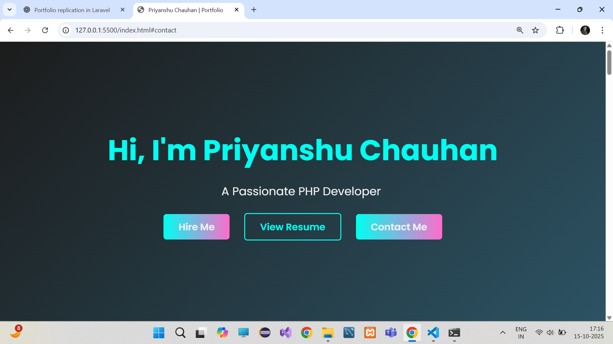
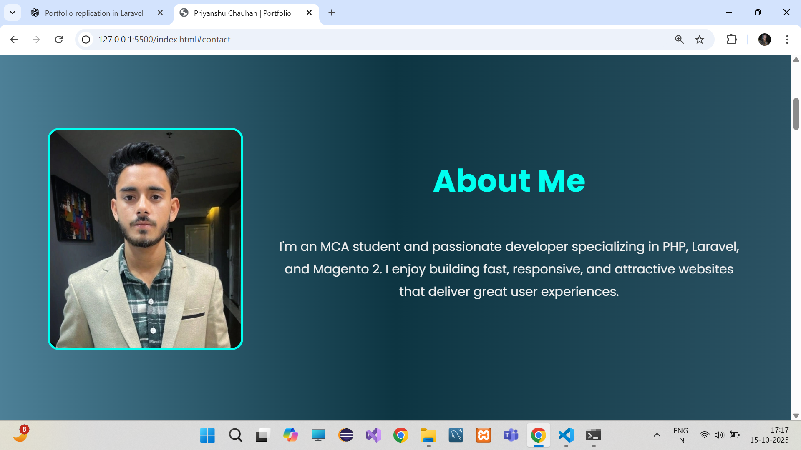
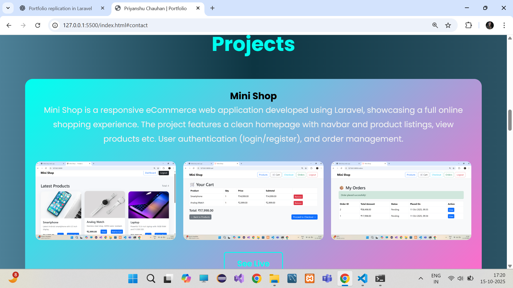

# Priyanshu Chauhan Portfolio

This is my personal portfolio website, built as a **single-page, responsive web application** using **HTML, CSS, and JavaScript**.  

The portfolio showcases my skills, experience, and projects in a **clean and professional layout**. It features smooth scrolling animations, interactive buttons, and an attractive UI design, making it ideal for presenting my work to potential clients or employers.  

The website is structured to highlight:  
- A Hero section introducing me and my role as a PHP/Laravel developer  
- An About Me section with my profile and skills  
- Projects section displaying my notable projects with descriptions and screenshots  
- Contact section with details to reach me directly  

## Portfolio Screenshots

## Resume
Download my resume here: [Resume PDF](assets/resume.pdf)
